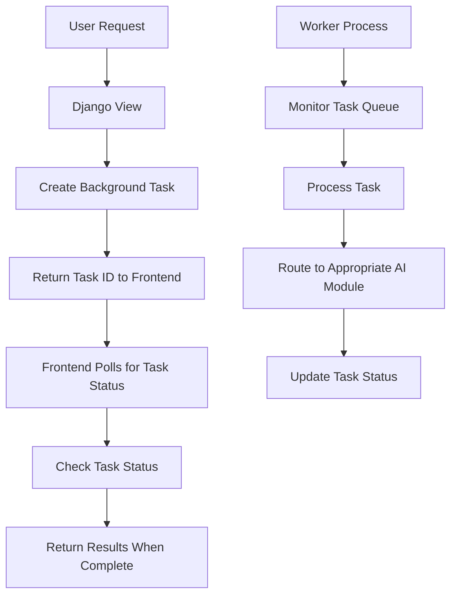

# Refactoring Plan: Using Django Background Tasks for AI/LangGraph Code

## Overview

This document outlines a comprehensive plan to refactor the current asynchronous AI/LangGraph code to use Django Background Tasks. The primary goal is to remove the async code and implement a queue-based approach where a worker process monitors the queue and executes AI tasks.



## Current Implementation Analysis

1. **Async Implementation**: The current system uses async/await patterns with asyncio for handling AI operations:
   - `syllabus/ai/syllabus_graph.py` - Manages syllabus generation workflow
   - `lessons/ai/lesson_graph.py` - Manages lesson interactions
   - `lessons/content_service.py` - Handles lesson content generation

2. **LangGraph Usage**: The system uses LangGraph for orchestrating AI workflows:
   - StateGraph for defining nodes and edges
   - Async streaming for processing graph steps
   - Complex state management between nodes

3. **Current Flow**:
   - User requests trigger async operations
   - Frontend polls for completion
   - Async tasks update database records with status (PENDING, GENERATING, COMPLETED, FAILED)

4. **Pain Points**:
   - Complex async code with error handling
   - Polling mechanism for checking task status
   - No centralized task queue management

## Refactoring Plan

### 1. Setup and Configuration

#### 1.1 Install Django Background Tasks
- Add `django-background-tasks` to project dependencies
- Add `background_task` to INSTALLED_APPS in settings.py
- Configure background tasks settings

```python
# Add to pyproject.toml dependencies
"django-background-tasks>=1.2.5",

# Add to settings.py INSTALLED_APPS
INSTALLED_APPS = [
    # ... existing apps
    "background_task",
]

# Add background tasks settings to settings.py
# Maximum number of concurrent tasks
MAX_ATTEMPTS = 3  # Number of times a task will be attempted
MAX_RUN_TIME = 3600  # Maximum running time in seconds (1 hour)
BACKGROUND_TASK_RUN_ASYNC = False  # Run tasks synchronously in the worker
```

#### 1.2 Create Task Queue Model
- Create a new app called `taskqueue` to manage AI tasks
- Create a custom model to track AI tasks

```python
# taskqueue/models.py
from django.db import models
import uuid

class AITask(models.Model):
    class TaskType(models.TextChoices):
        SYLLABUS_GENERATION = 'syllabus_generation', 'Syllabus Generation'
        LESSON_CONTENT = 'lesson_content', 'Lesson Content Generation'
        LESSON_INTERACTION = 'lesson_interaction', 'Lesson Interaction'
    
    class TaskStatus(models.TextChoices):
        PENDING = 'pending', 'Pending'
        PROCESSING = 'processing', 'Processing'
        COMPLETED = 'completed', 'Completed'
        FAILED = 'failed', 'Failed'
    
    task_id = models.UUIDField(primary_key=True, default=uuid.uuid4, editable=False)
    task_type = models.CharField(max_length=50, choices=TaskType.choices)
    status = models.CharField(max_length=20, choices=TaskStatus.choices, default=TaskStatus.PENDING)
    input_data = models.JSONField()
    result_data = models.JSONField(null=True, blank=True)
    error_message = models.TextField(null=True, blank=True)
    created_at = models.DateTimeField(auto_now_add=True)
    updated_at = models.DateTimeField(auto_now=True)
    attempt_count = models.IntegerField(default=0)
    
    # Add relevant foreign keys based on task type
    syllabus = models.ForeignKey('core.Syllabus', null=True, blank=True, on_delete=models.CASCADE)
    lesson = models.ForeignKey('core.Lesson', null=True, blank=True, on_delete=models.CASCADE)
    user = models.ForeignKey('auth.User', null=True, blank=True, on_delete=models.CASCADE)
    
    def __str__(self):
        return f"{self.task_type} - {self.status} - {self.task_id}"
```

### 2. Task Processing Infrastructure

#### 2.1 Create Task Processors

```python
# taskqueue/tasks.py
from background_task import background
from .models import AITask
import logging
import time

logger = logging.getLogger(__name__)

# Decorator with exponential backoff for retries
@background(schedule=0)
def process_ai_task(task_id):
    """Process an AI task from the queue"""
    try:
        task = AITask.objects.get(task_id=task_id)
        
        # Update status to processing
        task.status = AITask.TaskStatus.PROCESSING
        task.attempt_count += 1
        task.save()
        
        # Route to appropriate processor based on task type
        if task.task_type == AITask.TaskType.SYLLABUS_GENERATION:
            result = process_syllabus_generation(task)
        elif task.task_type == AITask.TaskType.LESSON_CONTENT:
            result = process_lesson_content(task)
        elif task.task_type == AITask.TaskType.LESSON_INTERACTION:
            result = process_lesson_interaction(task)
        else:
            raise ValueError(f"Unknown task type: {task.task_type}")
        
        # Update task with result
        task.result_data = result
        task.status = AITask.TaskStatus.COMPLETED
        task.save()
        
    except Exception as e:
        logger.error(f"Error processing task {task_id}: {str(e)}", exc_info=True)
        try:
            task = AITask.objects.get(task_id=task_id)
            task.error_message = str(e)
            
            # Implement retry logic with exponential backoff
            if task.attempt_count < 3:  # MAX_ATTEMPTS
                # Schedule retry with exponential backoff
                # 1st retry: 5 min, 2nd retry: 20 min, 3rd retry: 80 min
                backoff_minutes = 5 * (4 ** (task.attempt_count - 1))
                task.status = AITask.TaskStatus.PENDING
                task.save()
                
                # Reschedule the task
                process_ai_task(task_id, schedule=backoff_minutes * 60)  # Convert to seconds
                logger.info(f"Rescheduled task {task_id} for retry in {backoff_minutes} minutes")
            else:
                # Max retries reached, mark as failed
                task.status = AITask.TaskStatus.FAILED
                task.save()
                logger.error(f"Task {task_id} failed after {task.attempt_count} attempts")
        except Exception as inner_e:
            logger.error(f"Error handling task failure for {task_id}: {str(inner_e)}", exc_info=True)
```

#### 2.2 Create Task Status API

```python
# taskqueue/views.py
from django.http import JsonResponse
from django.views.decorators.http import require_GET
from django.contrib.auth.decorators import login_required
from .models import AITask

@login_required
@require_GET
def check_task_status(request, task_id):
    """Check the status of a background task"""
    try:
        task = AITask.objects.get(task_id=task_id)
        
        # Ensure the user has permission to view this task
        if task.user and task.user != request.user and not request.user.is_staff:
            return JsonResponse({'status': 'error', 'message': 'Permission denied'}, status=403)
        
        response = {
            'status': task.status,
            'created_at': task.created_at,
            'updated_at': task.updated_at,
        }
        
        if task.status == AITask.TaskStatus.COMPLETED:
            response['result'] = task.result_data
        elif task.status == AITask.TaskStatus.FAILED:
            response['error'] = task.error_message
            
        return JsonResponse(response)
        
    except AITask.DoesNotExist:
        return JsonResponse({'status': 'error', 'message': 'Task not found'}, status=404)
```

### 3. Refactor Syllabus Generation

#### 3.1 Refactor Syllabus Graph

```python
# taskqueue/processors/syllabus_processor.py
from syllabus.ai.syllabus_graph import SyllabusAI

def process_syllabus_generation(task):
    """Process a syllabus generation task"""
    # Extract parameters from input_data
    topic = task.input_data.get('topic')
    knowledge_level = task.input_data.get('knowledge_level')
    user_id = task.input_data.get('user_id')
    
    # Initialize syllabus AI
    syllabus_ai = SyllabusAI()
    syllabus_ai.initialize(topic, knowledge_level, user_id)
    
    # Run synchronously (no async/await)
    # We'll need to modify SyllabusAI to have a synchronous version of get_or_create_syllabus
    result = syllabus_ai.get_or_create_syllabus_sync()
    
    return result
```

#### 3.2 Update Syllabus Views

```python
# syllabus/views.py (modified)
from django.http import JsonResponse
from django.shortcuts import render, redirect
from taskqueue.models import AITask
from taskqueue.tasks import process_ai_task

def generate_syllabus(request):
    """Create a background task for syllabus generation"""
    if request.method == 'POST':
        topic = request.POST.get('topic')
        knowledge_level = request.POST.get('knowledge_level')
        user_id = request.user.id if request.user.is_authenticated else None
        
        # Create task record
        task = AITask.objects.create(
            task_type=AITask.TaskType.SYLLABUS_GENERATION,
            input_data={
                'topic': topic,
                'knowledge_level': knowledge_level,
                'user_id': user_id
            },
            user=request.user if request.user.is_authenticated else None
        )
        
        # Schedule background task
        process_ai_task(str(task.task_id))
        
        # Redirect to waiting page
        return redirect('syllabus:wait_for_generation', task_id=task.task_id)
    
    # GET request - show form
    return render(request, 'syllabus/generate_form.html')

def wait_for_generation(request, task_id):
    """Show waiting page while syllabus is being generated"""
    return render(request, 'syllabus/wait.html', {'task_id': task_id})
```

### 4. Refactor Lesson Content Generation

#### 4.1 Refactor Content Service

```python
# taskqueue/processors/lesson_processor.py
from lessons.content_service import _get_llm, _fetch_syllabus_structure
from core.models import Lesson, LessonContent
from core.constants import DIFFICULTY_VALUES
import json

def process_lesson_content(task):
    """Process a lesson content generation task"""
    # Extract parameters from input_data
    lesson_id = task.input_data.get('lesson_id')
    
    # Get the lesson
    lesson = Lesson.objects.get(pk=lesson_id)
    module = lesson.module
    syllabus = module.syllabus
    
    # Get or create lesson content
    lesson_content, created = LessonContent.objects.get_or_create(
        lesson=lesson,
        defaults={
            'content': {'status': 'placeholder'},
            'status': LessonContent.StatusChoices.GENERATING
        }
    )
    
    # Generate content using the same logic as in content_service.py
    # but without the async code
    
    # Initialize LLM
    llm = _get_llm()
    if not llm:
        raise ValueError("LLM could not be initialized")
    
    # Format prompt
    topic = syllabus.topic
    level = syllabus.level
    lesson_title = lesson.title
    syllabus_structure = _fetch_syllabus_structure(syllabus)
    syllabus_structure_json = json.dumps(syllabus_structure, indent=2)
    
    difficulty_value = DIFFICULTY_VALUES.get(level)
    if difficulty_value is None:
        word_count = 400
    else:
        word_count = (difficulty_value + 1) * 200
    
    from lessons.ai.prompts import GENERATE_LESSON_CONTENT_PROMPT, LATEX_FORMATTING_INSTRUCTIONS
    
    prompt_input = {
        'topic': topic,
        'level_name': level,
        'levels_list': list(DIFFICULTY_VALUES.keys()),
        'word_count': word_count,
        'lesson_title': lesson_title,
        'syllabus_structure_json': syllabus_structure_json,
        'latex_formatting_instructions': LATEX_FORMATTING_INSTRUCTIONS,
    }
    formatted_prompt = GENERATE_LESSON_CONTENT_PROMPT.format(**prompt_input)
    
    # Call LLM synchronously
    response = llm.invoke(formatted_prompt)
    generated_text = str(response.content).strip() if hasattr(response, 'content') else ""
    
    # Process response
    content_data = {}
    if generated_text:
        # Clean potential markdown code fences
        cleaned_text = generated_text
        if cleaned_text.startswith("```json"):
            cleaned_text = cleaned_text.removeprefix("```json").removesuffix("```").strip()
        elif cleaned_text.startswith("```"):
            cleaned_text = cleaned_text.removeprefix("```").removesuffix("```").strip()
        
        # Try JSON parsing
        try:
            parsed_data = json.loads(cleaned_text)
            if isinstance(parsed_data, dict):
                exposition_content = parsed_data.get("exposition", "")
                content_data = {"exposition": exposition_content}
            else:
                content_data = {
                    "error": "LLM output parsed but not a dictionary.",
                    "raw_response": cleaned_text,
                }
        except json.JSONDecodeError:
            content_data = {
                "error": "Failed to parse LLM output as JSON.",
                "raw_response": cleaned_text,
            }
    
    # Update lesson content
    lesson_content.content = content_data
    if "error" in content_data:
        lesson_content.status = LessonContent.StatusChoices.FAILED
    else:
        lesson_content.status = LessonContent.StatusChoices.COMPLETED
    lesson_content.save()
    
    return content_data
```

#### 4.2 Update Lesson Content Views

```python
# lessons/views.py (modified)
from django.http import JsonResponse
from django.shortcuts import render, redirect
from taskqueue.models import AITask
from taskqueue.tasks import process_ai_task

def generate_lesson_content(request, syllabus_id, module_index, lesson_index):
    """Create a background task for lesson content generation"""
    # Get the lesson
    lesson = get_object_or_404(
        Lesson,
        module__syllabus__pk=syllabus_id,
        module__module_index=module_index,
        lesson_index=lesson_index
    )
    
    # Create task record
    task = AITask.objects.create(
        task_type=AITask.TaskType.LESSON_CONTENT,
        input_data={
            'lesson_id': str(lesson.pk)
        },
        user=request.user if request.user.is_authenticated else None,
        lesson=lesson
    )
    
    # Schedule background task
    process_ai_task(str(task.task_id))
    
    # Return task ID for polling
    return JsonResponse({
        'status': 'pending',
        'task_id': str(task.task_id)
    })
```

### 5. Refactor Lesson Interaction

#### 5.1 Refactor Lesson Graph

```python
# taskqueue/processors/interaction_processor.py
from lessons.ai.lesson_graph import LessonInteractionGraph
from core.models import ConversationHistory, UserProgress

def process_lesson_interaction(task):
    """Process a lesson interaction task"""
    # Extract parameters from input_data
    progress_id = task.input_data.get('progress_id')
    user_message_content = task.input_data.get('user_message')
    submission_type = task.input_data.get('submission_type', 'chat')
    
    # Get the progress
    progress = UserProgress.objects.get(pk=progress_id)
    
    # Save user message
    if submission_type == "answer":
        user_message_type = "exercise_response"
    elif submission_type == "assessment":
        user_message_type = "assessment_response"
    else:
        user_message_type = "chat"
    
    ConversationHistory.objects.create(
        progress=progress,
        role="user",
        message_type=user_message_type,
        content=user_message_content,
    )
    
    # Load current state
    current_state = progress.lesson_state_json.copy()
    
    # Fetch recent conversation history
    history_limit = 10
    recent_history_qs = ConversationHistory.objects.filter(
        progress=progress
    ).order_by("-timestamp")[:history_limit]
    
    # Format for the graph state
    formatted_history = [
        {"role": msg.role, "content": msg.content}
        for msg in reversed(list(recent_history_qs))
    ]
    
    # Prepare state for graph
    current_state["history_context"] = formatted_history
    current_state.pop("conversation_history", None)
    current_state["last_user_message"] = user_message_content
    
    # Map submission_type to interaction_mode
    if submission_type in ["answer", "assessment"]:
        current_state["current_interaction_mode"] = "submit_answer"
    else:
        current_state["current_interaction_mode"] = "chatting"
    
    # Clear previous outputs
    current_state.pop("new_assistant_message", None)
    current_state.pop("evaluation_feedback", None)
    current_state.pop("error_message", None)
    
    # Invoke the graph synchronously
    graph = LessonInteractionGraph()
    output_state_dict = graph.graph.invoke(current_state, {"recursion_limit": 10})
    
    # Extract response
    assistant_response_content = output_state_dict.get("new_assistant_message")
    feedback_msg = output_state_dict.get("evaluation_feedback")
    
    if isinstance(feedback_msg, str):
        assistant_response_content = feedback_msg
    
    # Save assistant response
    if assistant_response_content:
        # Determine message type
        assistant_message_type = "chat"
        if output_state_dict.get("evaluation_feedback"):
            assistant_message_type = (
                "exercise_feedback"
                if output_state_dict.get("active_exercise")
                else "assessment_feedback"
            )
        elif output_state_dict.get("active_exercise"):
            assistant_message_type = "exercise_prompt"
        elif output_state_dict.get("active_assessment"):
            assistant_message_type = "assessment_prompt"
        
        ConversationHistory.objects.create(
            progress=progress,
            role="assistant",
            message_type=assistant_message_type,
            content=str(assistant_response_content),
        )
    
    # Update progress with new state
    final_state_dict = dict(output_state_dict)
    final_state_dict.pop("history_context", None)
    final_state_dict.pop("last_user_message", None)
    final_state_dict.pop("new_assistant_message", None)
    final_state_dict.pop("evaluation_feedback", None)
    
    progress.lesson_state_json = final_state_dict
    progress.save(update_fields=["lesson_state_json", "updated_at"])
    
    return {
        "assistant_message": assistant_response_content or "Sorry, I couldn't generate a response.",
        "updated_state": final_state_dict,
    }
```

#### 5.2 Update Lesson Interaction Views

```python
# lessons/views.py (modified)
from django.http import JsonResponse
from django.shortcuts import render, redirect
from taskqueue.models import AITask
from taskqueue.tasks import process_ai_task

def handle_lesson_interaction(request, syllabus_id, module_index, lesson_index):
    """Create a background task for lesson interaction"""
    if not request.user.is_authenticated:
        return JsonResponse(
            {"status": "error", "message": "Authentication required."}, status=401
        )
    
    try:
        # Get the lesson context
        syllabus = get_object_or_404(Syllabus, pk=syllabus_id)
        module = get_object_or_404(Module, syllabus=syllabus, module_index=module_index)
        lesson = get_object_or_404(Lesson, module=module, lesson_index=lesson_index)
        
        # Get or create progress
        progress, created = UserProgress.objects.get_or_create(
            user=request.user,
            syllabus=syllabus,
            lesson=lesson,
            defaults={
                "module_index": module.module_index,
                "lesson_index": lesson.lesson_index,
                "status": "in_progress",
            },
        )
        
        # Parse request data
        data = json.loads(request.body)
        user_message_content = data.get("message", "").strip()
        submission_type = data.get("submission_type", "chat")
        
        if not user_message_content:
            return JsonResponse(
                {"status": "error", "message": "Message cannot be empty."}, status=400
            )
        
        # Create task record
        task = AITask.objects.create(
            task_type=AITask.TaskType.LESSON_INTERACTION,
            input_data={
                'progress_id': str(progress.pk),
                'user_message': user_message_content,
                'submission_type': submission_type
            },
            user=request.user,
            lesson=lesson
        )
        
        # Schedule background task
        process_ai_task(str(task.task_id))
        
        # Return task ID for polling
        return JsonResponse({
            'status': 'pending',
            'task_id': str(task.task_id)
        })
        
    except Exception as e:
        return JsonResponse(
            {"status": "error", "message": str(e)}, status=500
        )
```

### 6. Frontend Updates

#### 6.1 Update JavaScript for Polling

```javascript
// static/js/task_polling.js
class TaskPoller {
    constructor(taskId, statusUrl, onComplete, onError, pollingInterval = 2000) {
        this.taskId = taskId;
        this.statusUrl = statusUrl;
        this.onComplete = onComplete;
        this.onError = onError;
        this.pollingInterval = pollingInterval;
        this.intervalId = null;
    }
    
    start() {
        this.checkStatus();
        this.intervalId = setInterval(() => this.checkStatus(), this.pollingInterval);
    }
    
    stop() {
        if (this.intervalId) {
            clearInterval(this.intervalId);
            this.intervalId = null;
        }
    }
    
    async checkStatus() {
        try {
            const response = await fetch(`${this.statusUrl}?task_id=${this.taskId}`);
            const data = await response.json();
            
            if (data.status === 'completed') {
                this.stop();
                this.onComplete(data.result);
            } else if (data.status === 'failed') {
                this.stop();
                this.onError(data.error || 'Task failed');
            }
            // For 'pending' or 'processing', continue polling
            
        } catch (error) {
            console.error('Error checking task status:', error);
        }
    }
}

// Example usage:
function initTaskPolling(taskId) {
    const statusUrl = '/api/tasks/status/';
    
    const poller = new TaskPoller(
        taskId,
        statusUrl,
        (result) => {
            // Handle successful completion
            document.getElementById('loading-indicator').style.display = 'none';
            document.getElementById('result-container').innerHTML = result.html_content;
            document.getElementById('result-container').style.display = 'block';
        },
        (error) => {
            // Handle error
            document.getElementById('loading-indicator').style.display = 'none';
            document.getElementById('error-container').textContent = `Error: ${error}`;
            document.getElementById('error-container').style.display = 'block';
        }
    );
    
    poller.start();
}
```

#### 6.2 Update Templates

```html
<!-- templates/lessons/wait.html -->



<div class="container">
    <h1>Generating Lesson Content</h1>
    
    <div id="loading-indicator" class="text-center">
        <div class="spinner-border" role="status">
            <span class="visually-hidden">Loading...</span>
        </div>
        <p>Please wait while we generate your lesson content...</p>
    </div>
    
    <div id="result-container" style="display: none;"></div>
    
    <div id="error-container" class="alert alert-danger" style="display: none;"></div>
</div>


<script src=""></script>
<script>
    document.addEventListener('DOMContentLoaded', function() {
        initTaskPolling('{{ task_id }}');
    });
</script>


```

### 7. Migration Plan

#### Phase 1: Setup and Infrastructure (Week 1)

1. **Install and Configure Django Background Tasks**
   - Add the package to dependencies
   - Configure settings
   - Create the taskqueue app and models
   - Set up basic task processing infrastructure

2. **Create Task Status API**
   - Implement API endpoints for checking task status
   - Create basic frontend polling mechanism

3. **Setup Worker Process**
   - Configure worker process for development
   - Test basic task creation and processing

#### Phase 2: Syllabus Generation Refactoring (Week 2)

1. **Create Synchronous Version of Syllabus Graph**
   - Add synchronous methods to SyllabusAI class
   - Implement syllabus generation task processor

2. **Update Syllabus Views**
   - Modify views to create background tasks
   - Update templates for task polling
   - Test end-to-end flow

3. **Validate and Test**
   - Ensure syllabus generation works correctly
   - Verify error handling and retries
   - Compare results with original async implementation

#### Phase 3: Lesson Content Generation Refactoring (Week 3)

1. **Create Synchronous Version of Content Service**
   - Implement lesson content generation task processor
   - Ensure it maintains the same logic as the async version

2. **Update Lesson Content Views**
   - Modify views to create background tasks
   - Update templates for task polling
   - Test end-to-end flow

3. **Validate and Test**
   - Ensure lesson content generation works correctly
   - Verify error handling and retries
   - Compare results with original async implementation

#### Phase 4: Lesson Interaction Refactoring (Week 4)

1. **Create Synchronous Version of Lesson Graph**
   - Implement lesson interaction task processor
   - Ensure it maintains the same logic as the async version

2. **Update Lesson Interaction Views**
   - Modify views to create background tasks
   - Update templates for task polling
   - Test end-to-end flow

3. **Validate and Test**
   - Ensure lesson interactions work correctly
   - Verify error handling and retries
   - Compare results with original async implementation

#### Phase 5: Cleanup and Optimization (Week 5)

1. **Remove Deprecated Async Code**
   - Once all functionality is verified, remove unused async code
   - Update imports and dependencies

2. **Optimize Worker Process**
   - Fine-tune worker process settings
   - Implement monitoring for task queue

3. **Final Testing and Documentation**
   - Comprehensive testing of all features
   - Update documentation

### 8. Running the Worker Process

To run the background tasks worker process:

```bash
python manage.py process_tasks
```

For production, you should set up a process manager like Supervisor to ensure the worker process stays running:

```ini
[program:techtree_tasks]
command=/path/to/venv/bin/python /path/to/project/manage.py process_tasks
directory=/path/to/project
user=www-data
autostart=true
autorestart=true
redirect_stderr=true
stdout_logfile=/path/to/logs/worker.log
```

### 9. Conclusion

This refactoring will significantly simplify the codebase by removing complex async code while maintaining the same functionality. The queue-based approach with Django Background Tasks provides better reliability, monitoring, and scalability for AI operations.

Key benefits:
- Centralized task queue management
- Improved error handling with automatic retries
- Better monitoring and visibility into task status
- Ability to scale worker processes independently
- Simplified codebase without complex async patterns

The phased migration approach allows for incremental changes and testing, minimizing the risk of disruption to the application.