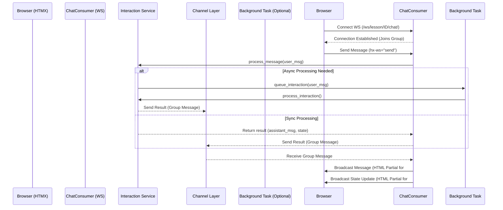
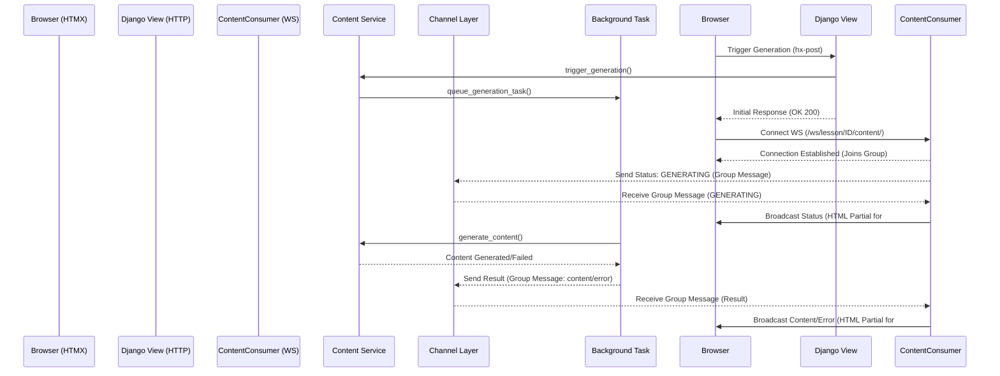

# Refactor Plan: Migrating lesson_detail.html to HTMX + HTMX Websockets (Django Backend)

## 1. Overview

**Goal**: Refactor all JavaScript-driven dynamic behaviors in `lessons/templates/lessons/lesson_detail.html` to use [HTMX](https://htmx.org/docs/) and the [HTMX websockets extension](https://v1.htmx.org/extensions/web-sockets/), using Django (with Django Channels) as the backend. Allow some redesign for a more "HTMX-native" experience.

---

## 2. Current Dynamic Behaviors in lesson_detail.html

| Feature                        | Current Implementation         | JS Pattern(s) Used         | Key JS Functions/Blocks |
|------------------------------- |-------------------------------|----------------------------|-------------------------|
| Change Difficulty              | AJAX fetch, loading overlay   | Click handler, fetch, overlay | `changeDifficultyBtn` listener (lines 202-258) |
| Content Generation Trigger     | AJAX POST                     | fetch                      | `triggerContentGeneration` (lines 338-376), Auto-trigger script (lines 76-103) |
| Content Generation Polling     | AJAX GET polling for status   | fetch, setTimeout          | `startPollingForContent` (lines 378-441) |
| Chat/Exercises Submission      | AJAX POST                     | Form submit, fetch         | `chatForm` listener (lines 484-577) |
| Chat/Exercises Polling         | AJAX GET polling for result   | fetch, setTimeout          | `pollForInteractionResult` (lines 579-621, patched 643-689) |
| Loading/Status Overlays        | JS DOM manipulation           | Show/hide overlays, spinners | `loadingOverlay`, `#loading-message` manipulation |
| Active Task Display            | JS DOM manipulation           | Render task, update UI     | `displayActiveTask` (lines 285-313) |
| Chat Message Display           | JS DOM manipulation           | Append message, scroll     | `appendMessage` (lines 445-473) |
| Math Rendering                 | JS call to MathJax/KaTeX      | `renderMath` (lines 190-198) |

---

## 3. HTMX/HTMX-Websockets Mapping

### 3.1. Change Difficulty

- **Trigger**: Replace JS click handler with an HTMX `hx-post` attribute on the button (`#change-difficulty-btn`).
  - `hx-post=""`
  - `hx-confirm="Are you sure...?"`
  - `hx-indicator="#loading-overlay"` (or a more localized indicator)
- **Loading**: Use `hx-indicator`. The existing `#loading-overlay` can be used or replaced with a simpler indicator within the button/link itself.
- **Response**: The Django view (`lessons.views.change_difficulty`) should return an HTTP response with an `HX-Redirect` header pointing to the new syllabus URL upon success, or an error message partial (swapped into an error display area) on failure.
- **JS Removal**: Remove lines 202-258.

### 3.2. Content Generation & Status

- **Trigger**:
  - For automatic regeneration on failure (lines 76-103): Use an HTMX attribute on a container element that loads automatically, e.g., `<div hx-post="{{ regeneration_url }}" hx-trigger="load" hx-swap="none"></div>`.
  - For initial load/pending status (lines 334-336): Use a similar `hx-trigger="load"` pattern on the `#lesson-content-area` or a wrapper, pointing to the `generate_content` URL.
- **Status Updates (Replaces Polling)**:
  - **Backend**: Implement a Django Channels consumer (`ContentConsumer`) mapped to a URL like `/ws/lesson/{{ lesson.pk }}/content/`.
  - **Frontend**: Add `hx-ws="connect:/ws/lesson/{{ lesson.pk }}/content/"` to the `#lesson-content-area` (or a wrapper).
  - **Flow**:
        1. The `generate_content` view (triggered by `hx-post`) starts the background task.
        2. The view/task sends an initial "GENERATING" message via the Channels layer to the `ContentConsumer`.
        3. The consumer broadcasts this message to the connected client.
        4. HTMX receives the message and swaps the content of `#lesson-content-area` with a "Generating..." template partial sent in the message.
        5. The background task completes/fails and sends the final HTML content or an error message via the Channels layer.
        6. The consumer broadcasts this final message.
        7. HTMX swaps the content of `#lesson-content-area` with the final content/error partial.
- **JS Removal**: Remove lines 76-104, 318-441.

### 3.3. Chat/Exercises & Status

- **Connection**: Add `hx-ws="connect:/ws/lesson/{{ lesson.pk }}/chat/"` to a container element like `#lesson-interaction-area`.
- **Submission**: Modify the chat form (`#chat-form`) to send messages via the websocket connection:
  - Add `hx-ws="send"` to the form tag.
  - Inputs within the form will be automatically serialized (including the CSRF token if handled correctly, potentially using `django-htmx`).
- **Receiving Messages/Updates**:
  - **Backend**: Implement a Django Channels consumer (`ChatConsumer`) mapped to `/ws/lesson/{{ lesson.pk }}/chat/`. It receives messages, calls the `interaction_service`, and broadcasts responses/state updates (new messages, new tasks) back to the client(s) in that lesson's group.
  - **Frontend**: Messages from the consumer should target specific areas for updates:
    - New chat messages: Target `#chat-history` with `hx-swap="beforeend"`. The consumer sends HTML partials for new messages.
    - Active task updates: Target `#active-task-area` with `hx-swap="innerHTML"`. The consumer sends the HTML partial for the new task.
- **JS Removal**: Remove lines 260-317, 443-622, 634-690.

### 3.4. Loading/Status Overlays

- Use HTMX's `hx-indicator` class toggling for request-response cycles (like difficulty change).
- For websocket-driven updates (content generation, chat), the loading state will be part of the HTML partials swapped in (e.g., a "Generating..." message within `#lesson-content-area`). The dedicated full-screen overlay might become redundant or used only for the initial page load/difficulty change.
- **JS Removal**: Remove direct JS manipulation of `#loading-overlay` and `#loading-message`.

### 3.5. Active Task Display

- This becomes part of the websocket updates targeting `#active-task-area`, driven by the `ChatConsumer`.
- **JS Removal**: Remove `displayActiveTask` function (lines 285-313).

### 3.6. Chat Message Display

- Handled by websocket messages targeting `#chat-history` with `hx-swap="beforeend"`.
- **JS Removal**: Remove `appendMessage` function (lines 445-473).

### 3.7. Math Rendering

- HTMX triggers events after content is swapped (e.g., `htmx:afterSwap`). A small JS snippet can listen for this event and call `renderMath()` on the newly added content.

    ```javascript
    document.body.addEventListener('htmx:afterSwap', function(evt) {
      // Check if the swapped element or its children might contain math
      if (evt.detail.target.id === 'lesson-content-area' || evt.detail.target.id === 'chat-history') {
          renderMath(evt.detail.target); // Render only in the swapped element
      }
    });
    ```

- **JS Modification**: Keep `renderMath` (lines 190-198), replace `DOMContentLoaded` listener with the `htmx:afterSwap` listener.

---

## 4. Backend Requirements

- **Django Channels**: Install (`uv add channels channels-redis daphne`) and configure.
  - `settings.py`: Add `daphne`, `channels` to `INSTALLED_APPS`. Set `ASGI_APPLICATION = 'techtree_django.asgi.application'`. Configure `CHANNEL_LAYERS` (e.g., using Redis).
  - `techtree_django/asgi.py`: Setup `ProtocolTypeRouter` with `HTTP` and `websocket` routes.
  - `lessons/routing.py`: Define `websocket_urlpatterns` for `/ws/lesson/<int:pk>/content/` and `/ws/lesson/<int:pk>/chat/`.
  - `techtree_django/routing.py`: Include `lessons.routing.websocket_urlpatterns`.
- **Consumers**: Create `lessons/consumers.py` with `ContentConsumer` and `ChatConsumer` classes inheriting from `AsyncWebsocketConsumer` or `JsonWebsocketConsumer`. Implement `connect`, `disconnect`, `receive`, and methods to handle broadcasting messages from background tasks/services via the channel layer (`async_to_sync(channel_layer.group_send)(...)`).
- **Views**: Modify views (`change_difficulty`, `generate_content`, interaction views) to handle HTMX requests (`request.htmx`) and trigger actions that eventually push updates via consumers. Return appropriate HTMX responses (partials, redirects).
- **Templates**: Update `lesson_detail.html` and create necessary partial templates for swapped content (chat messages, loading states, content area, task area).
- **django-htmx**: Consider adding `uv add django-htmx` and including its middleware for easier HTMX request detection and CSRF handling.

---

## 5. Migration Strategy

**Step 1: Setup Backend Infrastructure**

- Install dependencies (`channels`, `channels-redis`, `daphne`, `django-htmx`).
- Configure `settings.py`, `asgi.py`, and `routing.py`.
- Create basic `lessons/consumers.py` structure.

**Step 2: Include HTMX Frontend**

- Add HTMX and websockets extension JS to `base.html`.
- Add `django-htmx` middleware and ensure CSRF works.

**Step 3: Refactor Change Difficulty**

- Update button with `hx-post`, `hx-indicator`, `hx-confirm`.
- Modify `change_difficulty` view for `HX-Redirect`.
- Remove corresponding JS. Test.

**Step 4: Refactor Content Generation (Trigger + WS Updates)**

- Implement `ContentConsumer`.
- Update `generate_content` view to trigger task and potentially send initial WS message.
- Modify background task to send final content/error via channel layer to consumer.
- Add `hx-ws="connect..."` to template.
- Add `hx-post` trigger for generation.
- Remove polling JS. Test.

**Step 5: Refactor Chat/Exercises (WS Send/Receive)**

- Implement `ChatConsumer`.
- Update chat form with `hx-ws="send"`.
- Update interaction service/task to send responses/state via channel layer to consumer.
- Add `hx-ws="connect..."` to template.
- Ensure consumer broadcasts target `#chat-history` and `#active-task-area`.
- Remove chat submission/polling/display JS. Test.

**Step 6: Refactor Math Rendering**

- Add `htmx:afterSwap` listener to call `renderMath`.
- Remove old `DOMContentLoaded` math rendering call. Test.

**Step 7: Cleanup & Final Testing**

- Remove all redundant JS code blocks and functions identified in section 3.
- Remove unused HTML elements (e.g., old loading indicators if replaced).
- Perform thorough end-to-end testing.

**Step 8: Generalize**

- Document the patterns used.
- Identify other areas in the application with similar JS patterns and apply the HTMX/websocket refactoring.

---

## 6. Architecture & Data Flow (Mermaid Diagrams)

### 6.1. High-Level Architecture

```mermaid
graph TD
    subgraph Browser
        A[lesson_detail.html with HTMX]
        B(HTMX Library)
        C(HTMX Websockets Ext)
    end
    subgraph Django Server (ASGI with Daphne/Uvicorn)
        D[Django Views (HTTP)]
        E[Django Channels Consumers (WS)]
        F[Background Tasks (Celery/RQ/etc.)]
        G[Services (Content, Interaction)]
        H[Database]
        I[Channel Layer (Redis)]
    end

    A -- HTTP Requests (hx-*) --> D
    D -- Triggers --> F
    D -- Calls --> G
    G -- Accesses --> H
    F -- Calls --> G
    F -- Sends WS Message --> I

    A -- WS Connection (hx-ws) --> E
    E -- Receives/Sends WS Messages --> A
    E -- Calls --> G
    E -- Triggers --> F
    E -- Pub/Sub --> I

    C <--> B
    B <--> A
```

### 6.2. Chat Interaction Flow (Websockets)



### 6.3. Content Generation Flow (Websockets)



---

## 7. Potential Pitfalls & Considerations

- **Complexity**: Managing websocket state, groups, and broadcasts in Channels.
- **Error Handling**: Need robust error handling in consumers and background tasks, propagating errors back to the client via websockets.
- **Scalability**: Requires Redis (or similar) for the channel layer in production. ASGI server tuning.
- **Testing**: Requires `channels.testing.WebsocketCommunicator` for consumer tests. End-to-end testing becomes more involved.
- **CSRF**: `django-htmx` helps, but ensure tokens are handled correctly, especially with websocket connections if needed (though typically auth is handled at connection time).
- **State Synchronization**: Ensure backend state changes consistently trigger websocket updates to keep the frontend synchronized.
- **Deployment**: Requires an ASGI server like Daphne or Uvicorn instead of/alongside WSGI (Gunicorn).

---

## 8. Next Steps

1. **Confirm Plan**: Does this detailed plan look good?
2. **Write to File (Optional)**: Would you like this plan saved to `docs/htmx_refactor_plan.md`?
3. **Implementation**: If the plan is approved, we can switch to "Code" mode to start implementing Step 1 (Setup Backend Infrastructure).
