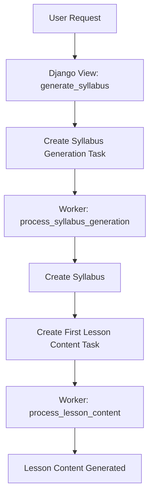

# Plan to Restore Automatic First Lesson Content Generation After Syllabus Creation

## Background

In the original async implementation, the function `trigger_first_lesson_generation(syllabus_id)` would:

- Locate the first lesson (module 0, lesson 0) of a syllabus.
- If no content existed or was generating, create a placeholder.
- Trigger async content generation for that lesson.

This ensured that **immediately after a syllabus was created, the first lesson's content would be generated automatically**.

During the refactor to Django Background Tasks, this behavior was **not replaced**. Currently, lesson content is only generated **on demand** via explicit API calls.

---

## Goal

Restore the automatic generation of the **first lesson's content** immediately after a syllabus is created, using the new background task system.

---

## Proposed Solution

### 1. Modify the Syllabus Generation Processor

In `taskqueue/processors/syllabus_processor.py`, **after** the syllabus is created:

- **Fetch the created syllabus** (using the ID from the task or the result).
- **Locate the first lesson**:
  - First module with `module_index=0`.
  - First lesson within that module with `lesson_index=0`.
- **Check if completed content exists** for that lesson.
- If **not**, create an `AITask` of type `LESSON_CONTENT` for that lesson.
- **Schedule** the lesson content generation task by calling `process_ai_task`.

---

### 2. Pseudocode

```python
def process_syllabus_generation(task):
    # Existing syllabus generation logic
    result = syllabus_ai.get_or_create_syllabus_sync()
    
    # Fetch the created syllabus object
    syllabus_id = result.get('syllabus_id') or task.syllabus_id
    syllabus = Syllabus.objects.get(pk=syllabus_id)
    
    # Find first module and lesson
    first_module = syllabus.modules.filter(module_index=0).first()
    if first_module:
        first_lesson = first_module.lessons.filter(lesson_index=0).first()
        if first_lesson:
            # Check if completed content exists
            existing_content = LessonContent.objects.filter(
                lesson=first_lesson,
                status=LessonContent.StatusChoices.COMPLETED
            ).first()
            if not existing_content:
                # Create lesson content task
                lesson_task = AITask.objects.create(
                    task_type=AITask.TaskType.LESSON_CONTENT,
                    input_data={'lesson_id': str(first_lesson.pk)},
                    syllabus=syllabus,
                    lesson=first_lesson,
                    user=task.user
                )
                process_ai_task(str(lesson_task.task_id))
```

---

### 3. Updated Architecture Diagram



---

### 4. Benefits

- Restores the **automatic first lesson content generation** behavior.
- Keeps the logic **inside the background task processor**, avoiding tight coupling in views.
- Ensures the first lesson is ready when the syllabus is done, improving user experience.
- Maintains a clean, decoupled, background task-driven architecture.

---

## Summary

- The async methods were removed.
- On-demand lesson content generation is still supported.
- Automatic first lesson content generation **is missing**.
- This plan restores that functionality by **triggering lesson content generation inside the syllabus processor** after syllabus creation.

---

## Additional: Restore Initial Lesson State Creation

### Background

In the original async implementation, the function `_initialize_lesson_state`:

- Created the **initial lesson state dictionary** for a user starting a lesson.
- Included lesson metadata, content, and other fields needed by the lesson graph.
- Was called when a user started a lesson for the first time.

During the refactor, this function was **removed** and **not replaced**.

Currently:

- The lesson interaction processor **expects** `UserProgress.lesson_state_json` to already exist.
- There is **no code** that initializes this state.
- This can lead to empty or invalid initial states, causing errors or degraded experience.

---

### Goal

Restore the creation of the **initial lesson state** when a user starts a lesson for the first time, using a **synchronous** function compatible with the new background task architecture.

---

### Proposed Solution

- Create a synchronous function, e.g., `initialize_lesson_state_sync(user, lesson, lesson_content) -> dict`, that:
  - Accepts:
    - `user`: the User object.
    - `lesson`: the Lesson object.
    - `lesson_content`: the LessonContent object.
  - Returns a dictionary with:
    - Lesson metadata (title, objectives, etc.).
    - The lesson content (exposition).
    - An empty conversation history.
    - Any other initial state fields needed by the lesson graph.

- When creating a new `UserProgress` object for a lesson **for the first time**:
  - Call this function.
  - Save the returned dict to `UserProgress.lesson_state_json`.

---

### Benefits

- Ensures the lesson graph always receives a valid initial state.
- Restores the original async behavior in a synchronous, background task-compatible way.
- Improves user experience by starting lessons with the correct context.

---

## Clarification on Synchronous Syllabus Generation

- The previously existing `async def get_or_generate_syllabus_sync(...)` function **does not exist** in the current codebase.
- The only reference is in an **old documentation file** (`docs/synchronous_syllabus_generation.md`).
- The current architecture **does not support synchronous syllabus generation without background tasks**.
- All syllabus generation is now handled **exclusively via background tasks**.
- This plan assumes **no bypass** of the background task system for synchronous syllabus generation.

---

## Next Step

Switch to **code mode** to implement these plans by modifying:

- `taskqueue/processors/syllabus_processor.py` (for first lesson content generation).
- The lesson progress creation logic (for initial lesson state creation).